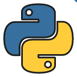

## Hello, I'm Pedro Mujica 👋 

## About me:
- 😃 My name is Pedro Miotto and my nickname is pedromujica1
- 📖 IT technician graduated at IFPR Campus Cascavel
- 🔭 I’m currently finding projects to contribute.
- 😄 Pronouns: He/him
- ⚡ Fun fact: I enjoy watching football and movies in my free time.

## Programming Languages

     

## I'm learning

 

          
## Connect with me

   

## Github Stats

  
  

<!--
**pedromujica1/pedromujica1** is a ✨ _special_ ✨ repository because its `README.md` (this file) appears on your GitHub profile.

Here are some ideas to get you started:

- 🔭 I’m currently working on ...
- 🌱 I’m currently learning ...
- 👯 I’m looking to collaborate on ...
- 🤔 I’m looking for help with ...
- 💬 Ask me about ...
- 📫 How to reach me: ...
- 😄 Pronouns: ...
- ⚡ Fun fact: ...
-->
